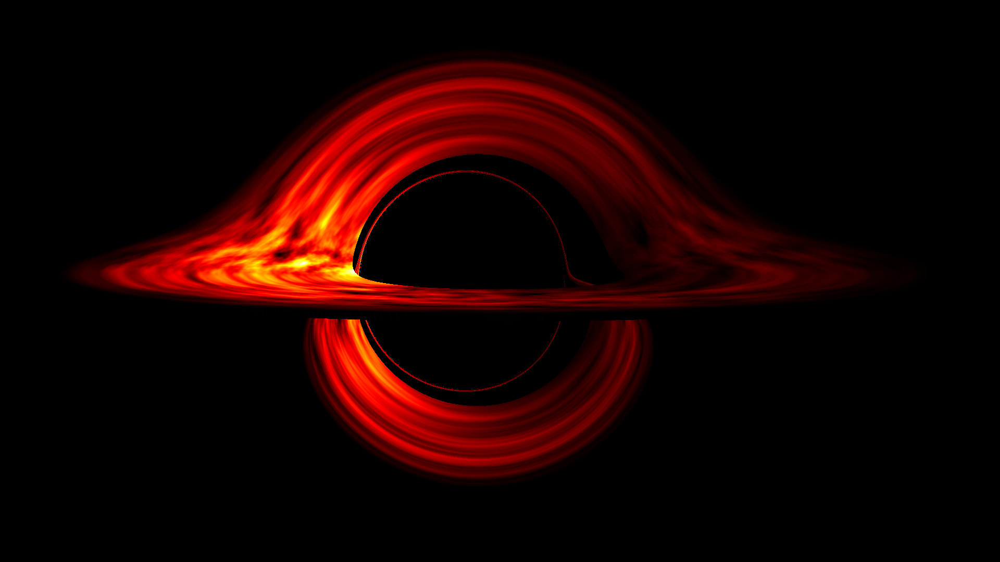

# COSMIC OpenGL Spacetime Metric In CUDA (COSMIC)

<!-- INSERT IMAGE/VIDEO HER -->


## Dependencies

- [CUDA](https://developer.nvidia.com/cuda-downloads): Download the latest CUDA Toolkit following 
  the install guide [here](https://docs.nvidia.com/cuda/index.html).
- [OpenMP](https://www.openmp.org/): For the CPU paralleized implementation install with 
  `brew install libomp` on macOS. On Linux, you can install it using your package manager
  (e.g., `sudo apt-get install libomp-dev` on Ubuntu).
- [CMake](https://cmake.org/download/): 
- [OpenGL](https://www.opengl.org/): For the OpenGL implementation, you will need to install the
  OpenGL libraries. On macOS, OpenGL is included by default. On Linux, it will depend on the
  distro (WSL, Ubunutu and Fedora have it by default).
- [GLAD](https://github.com/Dav1dde/glad): OpenGL extension loader is already included in the repo,
  but you can also generate the *Core* profile from [here](https://glad.dav1d.de/) and place it in
  the `external` directory.
- [GLFW](https://github.com/glfw/glfw):`brew install glfw` on macOS or install the
  development package `libglfw3-dev` on Linux.

## Build Instructions

### CMake

CMake is used to build this project. To create a build directory,

```bash
mkdir build && cd build
```

then configure the project and build it with

```bash
cmake ..
make
```

All the executables will be created in the `build/bin` directory and the output `.ppm` files will be
in `build/data`.

### Command-line Compilation

Currently only the CPU implementation is available for command-line compilation. Add execute
permissions to the bash script with `chmod +x compile.sh` and run it with `./compile.sh`.

## References

I don't fully understand every detail of the math/physics behind this project, but these
resources helped me in both the translating the math into code with CUDA and OpenGL.

- [physics stuff here]
- [gpu programming/opengl stuff here]

## Acknowledgements

Since this is an extension of my school project, I would like to thank my Computational Physics
professor [Alex Chen](https://www.giantflares.com/) for providing the main references
and guidance for implementing the original CPU version of the code.

## TODO:

- [x] explicit RK45 ODE Solver (Dormand-Prince adaptive step size)
- [x] Kerr Metric (rotating black hole) using Boyer-Lindquist coordinates
- [x] 3 + 1 Formulism Hamiltonian to decompose spacetime into equations of motion for the photon
- [x] Doppler boosting & gravitational redshift
- [x] OpenMP parallelization on CPU
- [X] OpenGL rendering
- [X] CUDA accelerated computations
- [X] CUDA optimizations
- [ ] CUDA + OpenGL interop
- [ ] clean up cpu implementation (run opengl on mac/windows?/linux)
- [ ] add compile script for linux+cuda

Extra TODO:
- [ ] Metal for macOS??
- [ ] Vulkan???